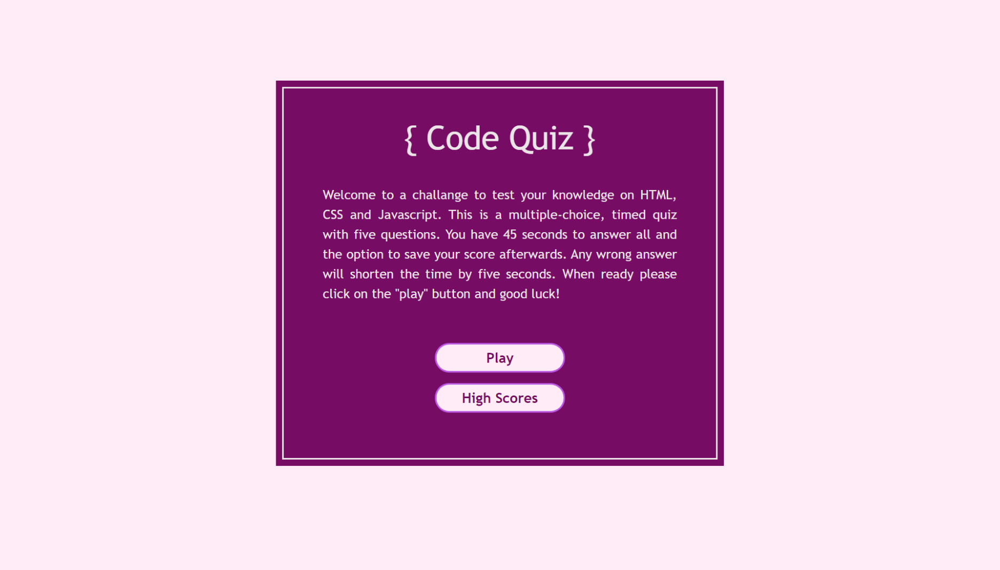
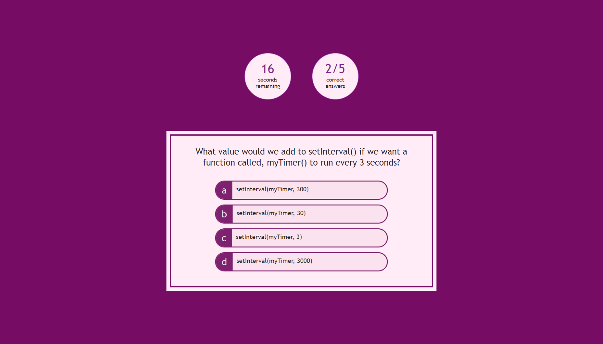
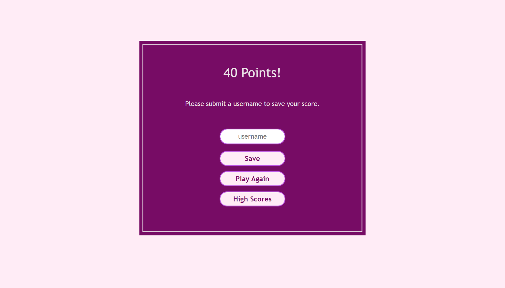
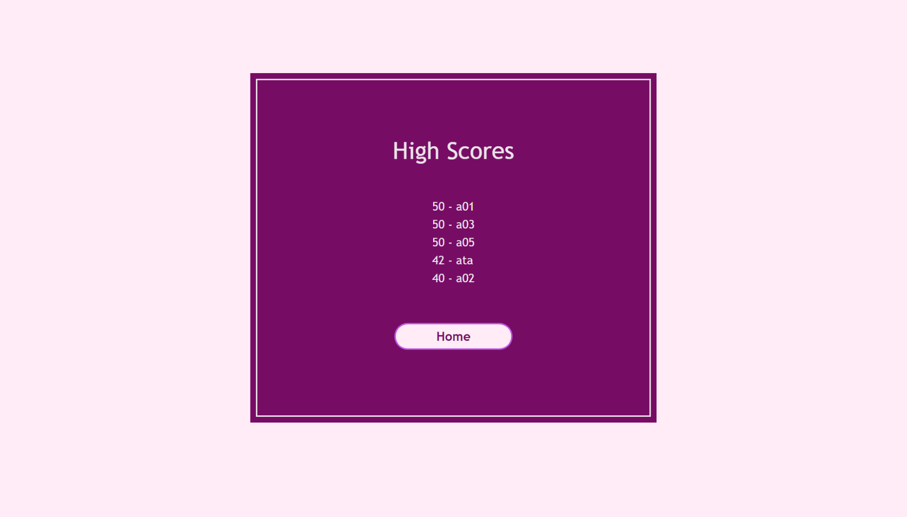

 

## **code quiz** 
 

[https://aranata.github.io/code-quiz/](https://aranata.github.io/code-quiz/) 
 
 

## description

***
 This is an application to run a timed quiz on coding that has five multiple-choice questions. The app has the ability to
 process the user input via mouse or keyboard in the browser window and determine the outcome. The last step includes
 the storage and call back of the highest results. It is featuring a dynamically updated HTML and CSS powered by JavaScript
 code - all without any initial coding. This work focuses on utilizing an array of API's like local storage and event listeners. 
The coding is organized over multiple HTML, CSS and JS files. Such an organization provided a better control over the whole and the parts.  
 

## acceptance criteria

***

The codebase achieves the following criteria: 

* GIVEN I am taking a code quiz: 
* WHEN I click the start button; THEN a timer starts and I am presented with a question 
* WHEN I answer a question; THEN I am presented with another question 
* WHEN I answer a question incorrectly; THEN time is subtracted from the clock 
* WHEN all questions are answered or the timer reaches 0; THEN the game is over 
* WHEN the game is over; THEN I can save my initials and my score 

 
 

## usage

***

A full view screenshot that shows the Home | Code Quiz: 
 

 
 

A full view screenshot that shows the Questions | Code Quiz: 
 

 
 

A full view screenshot that shows the Final | Code Quiz: 
 

 
 

A full view screenshot that shows the High Scores | Code Quiz: 
 

 
 

A short video that shows how the UI works. 
 

 
 

## some valuable references

***

These notes and links are listing some valuable references among others that I used doing this project: 
 

[https://developer.mozilla.org/](https://developer.mozilla.org/)

[https://getbutterfly.com/generate-html-list-from-javascript-array/](https://getbutterfly.com/generate-html-list-from-javascript-array/)

[https://www.kirupa.com/html5/random_numbers_js.htm](https://www.kirupa.com/html5/random_numbers_js.htm)

[https://www.jamesqquick.com/blog/](https://www.jamesqquick.com/blog/) 

[https://favicon.io/favicon-generator/](https://favicon.io/favicon-generator/)

[https://shields.io/category/dependencies/](https://shields.io/category/dependencies/)

[https://www.screencastify.com/](https://www.screencastify.com/)

 
 

## credits

***

Stephen Woosley - Bootcamp Instructor 
Patrick Haberern - Bootcamp TA 
Tim Nagorski - Bootcamp TA 
Sean Walmer - Bootcamp TA 
 
 

## license

***

This is an assigment done under a bootcamp program, it is public but please contact the publisher before you use or 
change any content. 
ghibli.github@gmail.com
 
 

## badges

***

 
 

---
